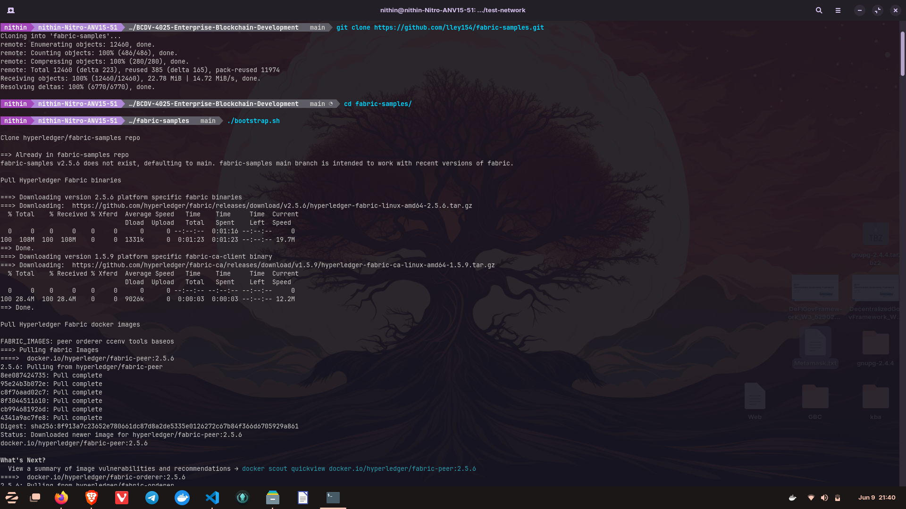
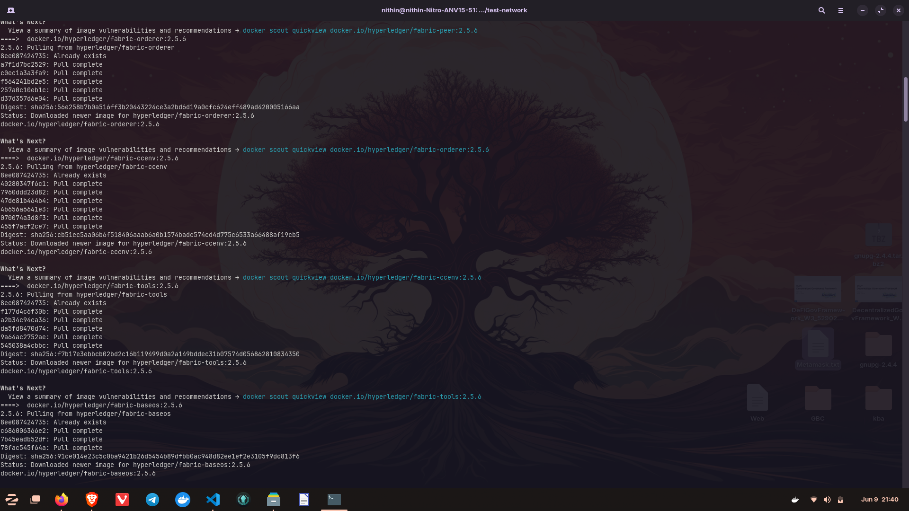
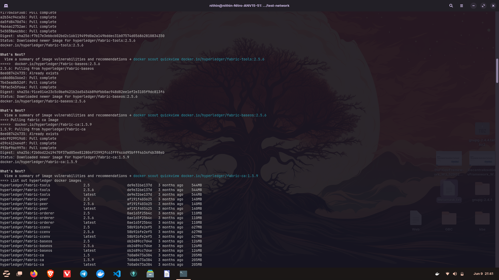
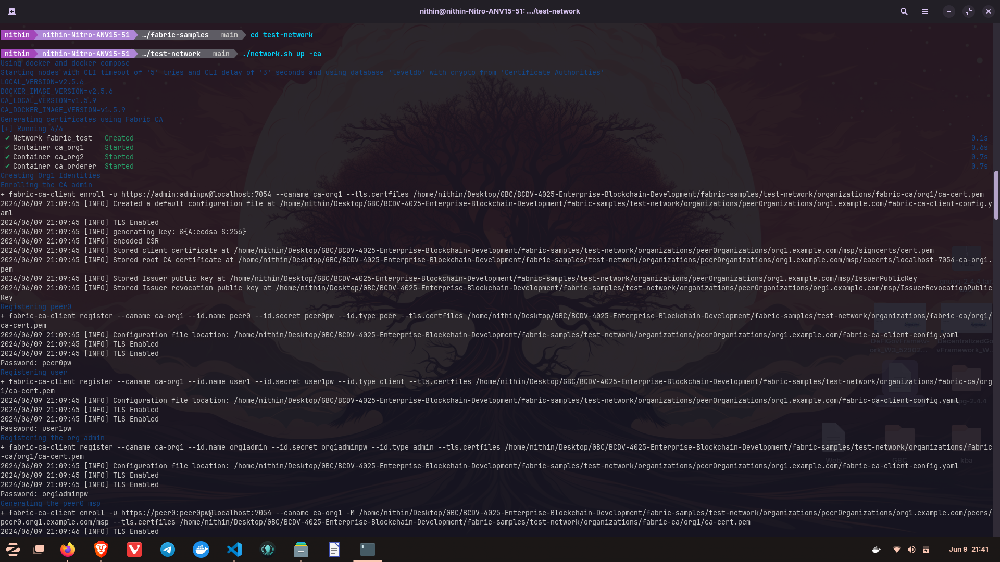
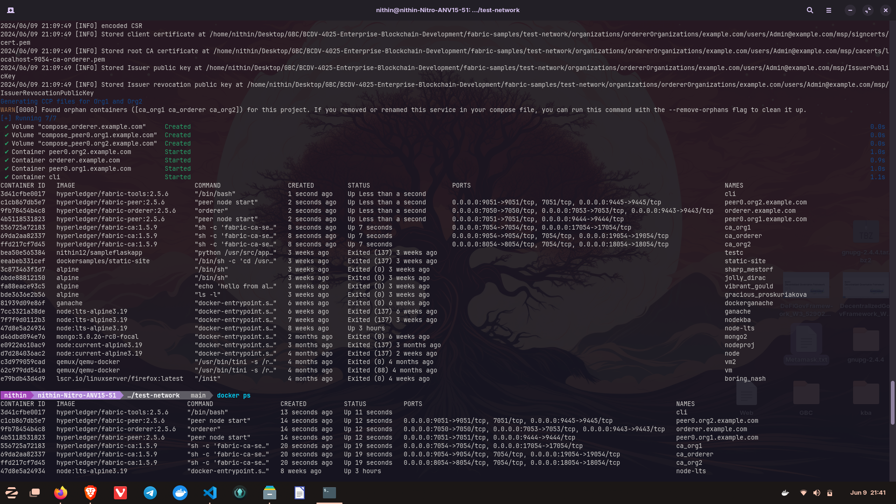
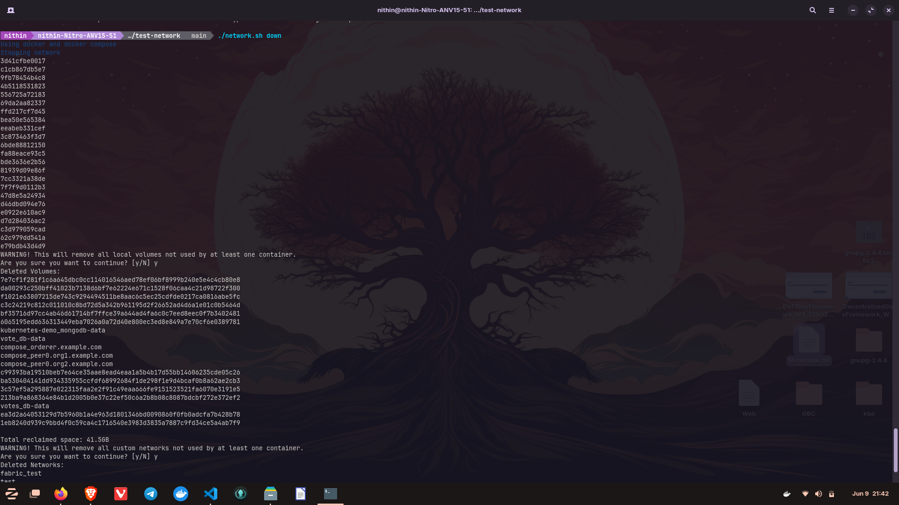

# Lab 1 - Install and run simple network

## Cloning the repo and downloads fabric binaries and docker images
```bash
$ git clone https://github.com/lley154/fabric-samples.git
$ cd fabric-samples
$ ./bootstrap.sh
```





## Start the Hyperledger Fabric test network with Certificate Authorities (CAs) enabled.
```bash
$ cd test-network
$ ./network.sh up -ca
$ docker ps -a
```



## Stop and remove the Hyperledger Fabric test network
```bash
$ ./network.sh down
```
