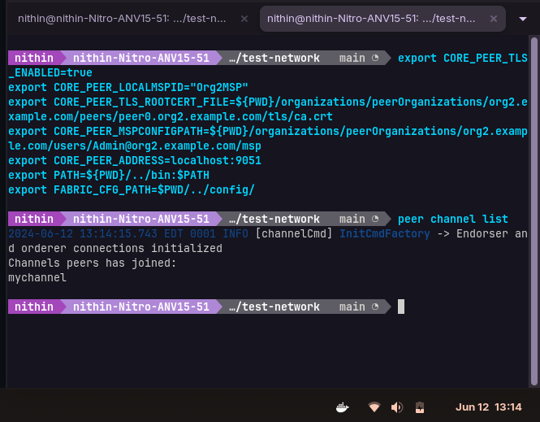

## fabric-chaincode-demo
### Deploying and executing a chaincode
```bash
$ git clone https://github.com/lley154/fabric-samples.git
$ cd fabric-samples/test-network
$ ./network.sh up createChannel -ca -s couchdb 
```


``` bash
$ cd ..
$ git clone https://github.com/lley154/fabric-chaincode-demo 
$ cd fabric-chaincode-demo  
$ curl -o- https://raw.githubusercontent.com/nvm-sh/nvm/v0.39.7/install.sh | bash
```


``` bash
$ source ~/.bashrc
$ nvm install 18.0.0
$ npm install
```


Open two terminals for each organization:

Terminal 1:


``` bash
$ cd fabric-samples/test-network
```
```bash
export CORE_PEER_TLS_ENABLED=true
export CORE_PEER_LOCALMSPID="Org1MSP"
export CORE_PEER_TLS_ROOTCERT_FILE=${PWD}/organizations/peerOrganizations/org1.example.com/peers/peer0.org1.example.com/tls/ca.crt
export CORE_PEER_MSPCONFIGPATH=${PWD}/organizations/peerOrganizations/org1.example.com/users/Admin@org1.example.com/msp
export CORE_PEER_ADDRESS=localhost:7051
export PATH=${PWD}/../bin:$PATH
export FABRIC_CFG_PATH=$PWD/../config/
```
```bash
$ sudo chmod a+rwx -R organizations  ## this is only done for lab env
$ sudo chmod a+rwx -R ../config  ## this is only done for lab env
$ peer channel list
```


Terminal 2:
```bash
cd fabric-samples/test-network
```
``` bash
export CORE_PEER_TLS_ENABLED=true
export CORE_PEER_LOCALMSPID="Org2MSP"
export CORE_PEER_TLS_ROOTCERT_FILE=${PWD}/organizations/peerOrganizations/org2.example.com/peers/peer0.org2.example.com/tls/ca.crt
export CORE_PEER_MSPCONFIGPATH=${PWD}/organizations/peerOrganizations/org2.example.com/users/Admin@org2.example.com/msp
export CORE_PEER_ADDRESS=localhost:9051
export PATH=${PWD}/../bin:$PATH
export FABRIC_CFG_PATH=$PWD/../config/
```
```bash
peer channel list
```


In both terminal windows follow these steps:

``` bash
$ peer lifecycle chaincode package simple_chaincode.tar.gz --path ../fabric-chaincode-demo --lang node --label simple_chaincode_1.0 
$ peer lifecycle chaincode install simple_chaincode.tar.gz 
$ export PACKAGE_ID=<Insert Chaincode code package identifier here>
$ peer lifecycle chaincode approveformyorg -o localhost:7050 --ordererTLSHostnameOverride orderer.example.com --channelID mychannel --name simple_chaincode --version 1.0 --package-id $PACKAGE_ID --sequence 1 --tls --cafile ${PWD}/organizations/ordererOrganizations/example.com/orderers/orderer.example.com/msp/tlscacerts/tlsca.example.com-cert.pem
$ peer lifecycle chaincode checkcommitreadiness --channelID mychannel --name simple_chaincode --version 1.0 --sequence 1 --tls --cafile ${PWD}/organizations/ordererOrganizations/example.com/orderers/orderer.example.com/msp/tlscacerts/tlsca.example.com-cert.pem --output json
```


In any one terminal follow these steps:

``` bash
$ peer lifecycle chaincode commit -o localhost:7050 --ordererTLSHostnameOverride orderer.example.com --channelID mychannel --name simple_chaincode --version 1.0 --sequence 1 --tls --cafile ${PWD}/organizations/ordererOrganizations/example.com/orderers/orderer.example.com/msp/tlscacerts/tlsca.example.com-cert.pem --peerAddresses localhost:7051 --tlsRootCertFiles ${PWD}/organizations/peerOrganizations/org1.example.com/peers/peer0.org1.example.com/tls/ca.crt --peerAddresses localhost:9051 --tlsRootCertFiles ${PWD}/organizations/peerOrganizations/org2.example.com/peers/peer0.org2.example.com/tls/ca.crt
$ peer lifecycle chaincode querycommitted --channelID mychannel --name simple_chaincode --cafile ${PWD}/organizations/ordererOrganizations/example.com/orderers/orderer.example.com/msp/tlscacerts/tlsca.example.com-cert.pem
$ peer chaincode invoke -o localhost:7050 --ordererTLSHostnameOverride orderer.example.com --tls --cafile ${PWD}/organizations/ordererOrganizations/example.com/orderers/orderer.example.com/msp/tlscacerts/tlsca.example.com-cert.pem -C mychannel -n simple_chaincode --peerAddresses localhost:7051 --tlsRootCertFiles ${PWD}/organizations/peerOrganizations/org1.example.com/peers/peer0.org1.example.com/tls/ca.crt --peerAddresses localhost:9051 --tlsRootCertFiles ${PWD}/organizations/peerOrganizations/org2.example.com/peers/peer0.org2.example.com/tls/ca.crt -c '{"function":"put","Args":["hello", "world"]}'
$ peer chaincode query -C mychannel -n simple_chaincode -c '{"function":"get","Args":["hello"]}'
$ peer chaincode invoke -o localhost:7050 --ordererTLSHostnameOverride orderer.example.com --tls --cafile ${PWD}/organizations/ordererOrganizations/example.com/orderers/orderer.example.com/msp/tlscacerts/tlsca.example.com-cert.pem -C mychannel -n simple_chaincode --peerAddresses localhost:7051 --tlsRootCertFiles ${PWD}/organizations/peerOrganizations/org1.example.com/peers/peer0.org1.example.com/tls/ca.crt --peerAddresses localhost:9051 --tlsRootCertFiles ${PWD}/organizations/peerOrganizations/org2.example.com/peers/peer0.org2.example.com/tls/ca.crt -c '{"function":"del","Args":["hello"]}'
$ peer chaincode query -C mychannel -n simple_chaincode -c '{"function":"get","Args":["hello"]}'
```


CouchDB UI locally

```browser
http://localhost:5984/_utils/#login
username: admin
password: adminpw
```

