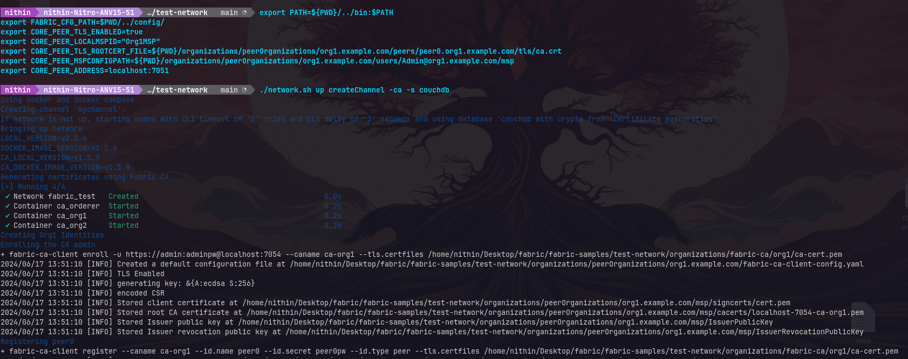

# Simple Account Transfer Application in Hyperledger Fabric
Note: You must complete Lab #1 and Lab #2 first which will include the required binary files.

Configure packages

```bash
sudo dpkg --configure -a

```
Install `jq`
```bash
sudo apt install jq
```


Navigate to the `fabric-samples` directory and clone the account balance transfer application repository

```bash
cd fabric-samples
git clone https://github.com/lley154/account_balance_transfer_app.git
```
## Part 1: Using peer command to interact with Chaincode

Change to the `test-network` directory and set up the environment variables
```bash
cd test-network
```
```bash
export PATH=${PWD}/../bin:$PATH
export FABRIC_CFG_PATH=$PWD/../config/
export CORE_PEER_TLS_ENABLED=true
export CORE_PEER_LOCALMSPID="Org1MSP"
export CORE_PEER_TLS_ROOTCERT_FILE=${PWD}/organizations/peerOrganizations/org1.example.com/peers/peer0.org1.example.com/tls/ca.crt
export CORE_PEER_MSPCONFIGPATH=${PWD}/organizations/peerOrganizations/org1.example.com/users/Admin@org1.example.com/msp
export CORE_PEER_ADDRESS=localhost:7051
```
Start the network channel
```bash
./network.sh up createChannel -ca -s couchdb
```
```bash
sudo chmod a+rwx -R organizations  ## this is only done for lab env
sudo chmod a+rwx -R ../config  ## this is only done for lab env
sudo chmod a+rwx log.txt  ## this is only done for lab env
```


Deploy the chaincode
```bash
./network.sh deployCC -ccn balance_transfer -ccv 1.0 -ccp ../account_balance_transfer_app/balance_transfer -ccl javascript
```


Test the setup by listing channels and installed chaincodes
```bash
peer channel list
peer lifecycle chaincode queryinstalled
```
Invoke chaincode
```bash
peer chaincode invoke \
    -o localhost:7050 \
    --ordererTLSHostnameOverride orderer.example.com \
    --tls --cafile ${PWD}/organizations/ordererOrganizations/example.com/orderers/orderer.example.com/msp/tlscacerts/tlsca.example.com-cert.pem \
    -C mychannel \
    -n balance_transfer \
    --peerAddresses localhost:7051 \
    --tlsRootCertFiles ${PWD}/organizations/peerOrganizations/org1.example.com/peers/peer0.org1.example.com/tls/ca.crt \
    --peerAddresses localhost:9051 \
    --tlsRootCertFiles ${PWD}/organizations/peerOrganizations/org2.example.com/peers/peer0.org2.example.com/tls/ca.crt \
    -c '{"function":"initAccount","Args":["A1","100"]}'
```
List the initial balance
```bash
peer chaincode query \
    -C mychannel \
    -n balance_transfer \
    -c '{"function":"listAccounts", "Args":[]}' | jq
```

Repeat same invoke command with -c '{"function":"setBalance","Args":["A1","150"]}'

```bash
peer chaincode invoke \
    -o localhost:7050 \
    --ordererTLSHostnameOverride orderer.example.com \
    --tls --cafile ${PWD}/organizations/ordererOrganizations/example.com/orderers/orderer.example.com/msp/tlscacerts/tlsca.example.com-cert.pem \
    -C mychannel \
    -n balance_transfer \
    --peerAddresses localhost:7051 \
    --tlsRootCertFiles ${PWD}/organizations/peerOrganizations/org1.example.com/peers/peer0.org1.example.com/tls/ca.crt \
    --peerAddresses localhost:9051 \
    --tlsRootCertFiles ${PWD}/organizations/peerOrganizations/org2.example.com/peers/peer0.org2.example.com/tls/ca.crt \
    -c '{"function":"setBalance","Args":["A1","150"]}'
```
Now, list the new balance
```bash
peer chaincode query \
    -C mychannel \
    -n balance_transfer \
    -c '{"function":"listAccounts", "Args":[]}' | jq
```

Change user to User1
```bash
export CORE_PEER_MSPCONFIGPATH=${PWD}/organizations/peerOrganizations/org1.example.com/users/User1@org1.example.com/msp
```
Initialize the account with some funds


```bash
peer chaincode invoke \
    -o localhost:7050 \
    --ordererTLSHostnameOverride orderer.example.com \
    --tls --cafile ${PWD}/organizations/ordererOrganizations/example.com/orderers/orderer.example.com/msp/tlscacerts/tlsca.example.com-cert.pem \
    -C mychannel \
    -n balance_transfer \
    --peerAddresses localhost:7051 \
    --tlsRootCertFiles ${PWD}/organizations/peerOrganizations/org1.example.com/peers/peer0.org1.example.com/tls/ca.crt \
    --peerAddresses localhost:9051 \
    --tlsRootCertFiles ${PWD}/organizations/peerOrganizations/org2.example.com/peers/peer0.org2.example.com/tls/ca.crt \
    -c '{"function":"initAccount","Args":["U1","150"]}'
```
Now transfer between User1 (U1) and Admin (A1)


```bash
peer chaincode invoke \
    -o localhost:7050 \
    --ordererTLSHostnameOverride orderer.example.com \
    --tls --cafile ${PWD}/organizations/ordererOrganizations/example.com/orderers/orderer.example.com/msp/tlscacerts/tlsca.example.com-cert.pem \
    -C mychannel \
    -n balance_transfer \
    --peerAddresses localhost:7051 \
    --tlsRootCertFiles ${PWD}/organizations/peerOrganizations/org1.example.com/peers/peer0.org1.example.com/tls/ca.crt \
    --peerAddresses localhost:9051 \
    --tlsRootCertFiles ${PWD}/organizations/peerOrganizations/org2.example.com/peers/peer0.org2.example.com/tls/ca.crt \
    -c   '{"function":"transfer","Args":["U1","A1", "100"]}'
```
List the final balance of U1

```bash
peer chaincode query \
    -C mychannel \
    -n balance_transfer \
    -c '{"function":"listAccounts", "Args":[]}' | jq
```

And then the final balance of A1

```bash
export CORE_PEER_MSPCONFIGPATH=${PWD}/organizations/peerOrganizations/org1.example.com/users/Admin@org1.example.com/msp

peer chaincode query \
    -C mychannel \
    -n balance_transfer \
    -c '{"function":"listAccounts", "Args":[]}' | jq
```

## Part 2: Using Fabric Application Gateway, Wallets to interact with Chaincode

Navigate to the `balance_transfer_app` directory and install Node.js dependencies
```bash
$ cd ../account_balance_transfer_app/balance_transfer_app
$ npm install
```
Enroll the admin user
```bash
node enrollUser.js 'CAAdmin@org1.example.com' admin adminpw
```

Now register user as follows
```bash
node registerUser.js 'CAAdmin@org1.example.com' 'User1@org1.example.com' '{"secret": "userpw"}'
```
Then enroll user
```bash
node enrollUser.js 'User1@org1.example.com' 'User1@org1.example.com' userpw
```
Using User1 credentials create account acc1
```bash
node submitTransaction.js 'User1@org1.example.com' initAccount acc1 100

```
To check the balance

```bash
node submitTransaction.js 'User1@org1.example.com' listAccounts
```
Register and enroll User2

```bash
$ node registerUser.js 'CAAdmin@org1.example.com' 'User2@org1.example.com' '{"secret": "userpw2"}'
$ node enrollUser.js 'User2@org1.example.com' 'User2@org1.example.com' userpw2
```

Using User 2 create acc2

```bash
node submitTransaction.js 'User2@org1.example.com' initAccount acc2 200
```

```bash
node submitTransaction.js 'User2@org1.example.com' listAccounts 
```

Now transfer 50 from acc2 to acc1

```bash
$ node submitTransaction.js 'User2@org1.example.com' transfer acc2 acc1 50
$ node submitTransaction.js 'User2@org1.example.com' listAccounts 
$ node submitTransaction.js 'User1@org1.example.com' listAccounts
```

Look and confirm there are 3 wallets created and have the certificate and private key for each.

```bash
ls -l wallet
```

```bash
cat wallet/User1@org1.example.com.id | jq
```


Note: If your network is restarted, you will need to remove the wallet directory (and regsiter and enroll again) because the public/private keys will no longer match the issuing CA on your network.