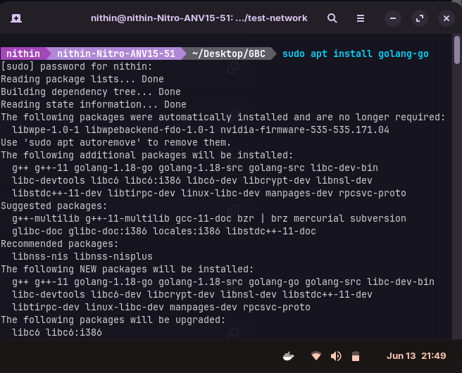
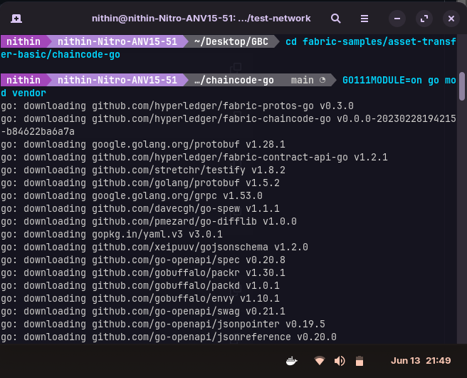
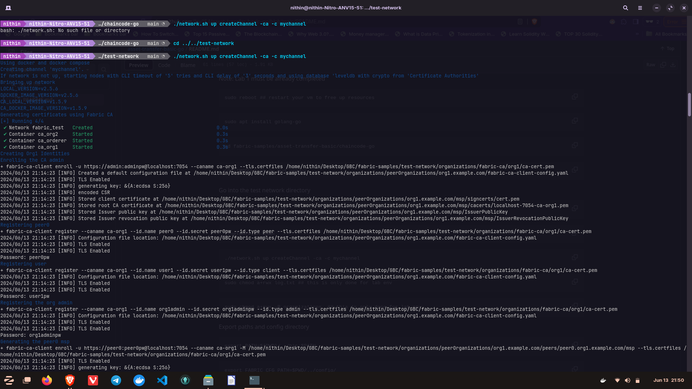
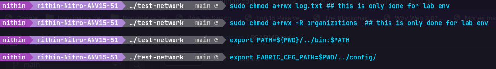
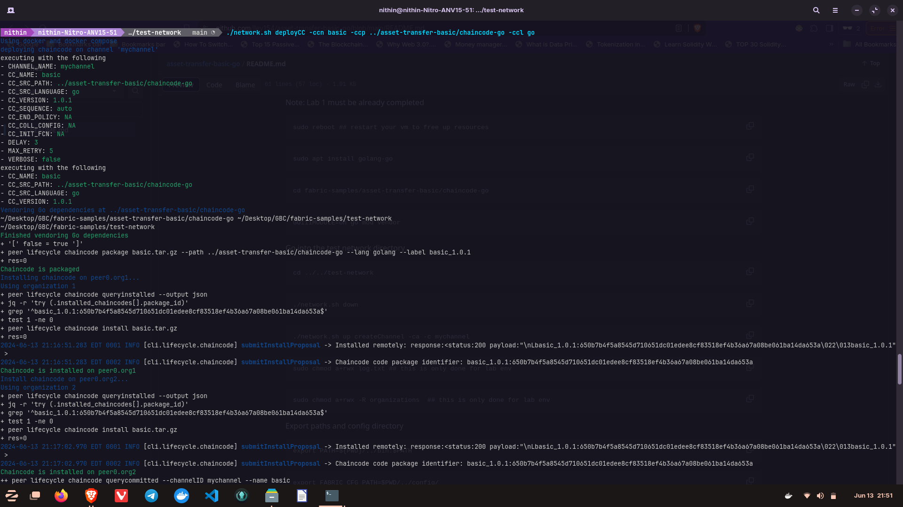
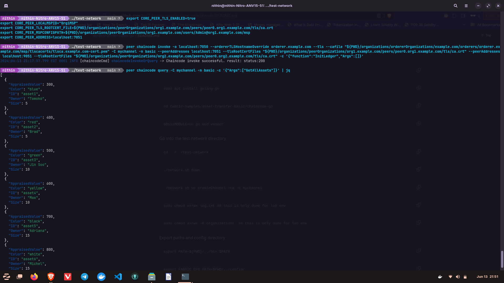

## asset-transfer-basic-go

Clone the project
```bash
git clone https://github.com/lley154/fabric-samples.git
```

Install Go

```bash
sudo apt install golang-go
```

Navigate to Chaincode Directory
```bash
cd fabric-samples/asset-transfer-basic/chaincode-go
```
Vendor Dependencies (create a local copy of all the dependencies required by the current Go module.
)
```bash
GO111MODULE=on go mod vendor
```


Navigate to Test Network Directory
```bash
cd ../../test-network
```
Start New Network and Create Channel
```bash
./network.sh up createChannel -ca -c mychannel
```


Change Permissions
```bash
$ sudo chmod a+rwx log.txt ## this is only done for lab env
$ sudo chmod a+rwx -R organizations  ## this is only done for lab env
```
Export Paths and Configuration Directory
```bash
export PATH=${PWD}/../bin:$PATH
export FABRIC_CFG_PATH=$PWD/../config/
```


Deploy Chaincode
```bash
./network.sh deployCC -ccn basic -ccp ../asset-transfer-basic/chaincode-go -ccl go
```


Set Environment Variables for Invocation
```bash
export CORE_PEER_TLS_ENABLED=true
export CORE_PEER_LOCALMSPID="Org1MSP"
export CORE_PEER_TLS_ROOTCERT_FILE=${PWD}/organizations/peerOrganizations/org1.example.com/peers/peer0.org1.example.com/tls/ca.crt
export CORE_PEER_MSPCONFIGPATH=${PWD}/organizations/peerOrganizations/org1.example.com/users/Admin@org1.example.com/msp
export CORE_PEER_ADDRESS=localhost:7051
```
Invoke the Chaincode
```bash
peer chaincode invoke -o localhost:7050 --ordererTLSHostnameOverride orderer.example.com --tls --cafile "${PWD}/organizations/ordererOrganizations/example.com/orderers/orderer.example.com/msp/tlscacerts/tlsca.example.com-cert.pem" -C mychannel -n basic --peerAddresses localhost:7051 --tlsRootCertFiles "${PWD}/organizations/peerOrganizations/org1.example.com/peers/peer0.org1.example.com/tls/ca.crt" --peerAddresses localhost:9051 --tlsRootCertFiles "${PWD}/organizations/peerOrganizations/org2.example.com/peers/peer0.org2.example.com/tls/ca.crt" -c '{"function":"InitLedger","Args":[]}'
```
Query the Chaincode
```bash
peer chaincode query -C mychannel -n basic -c '{"Args":["GetAllAssets"]}' | jq
```
