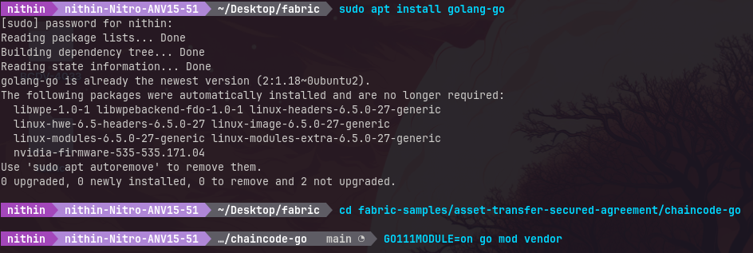

# asset-transfer-secured-agreement

Note: Lab #1 must be completed first

Installing Dependencies
```bash
sudo apt install jq
sudo apt install golang-go
```
Chaincode Directory
```bash
cd fabric-samples/asset-transfer-secured-agreement/chaincode-go
GO111MODULE=on go mod vendor
```

Navigates to the test network directory and stops any existing network instances
```bash
cd ../../test-network
./network.sh down  
```
Starts a new instance of the network
```bash
./network.sh up createChannel -ca -c mychannel
```

Adjusting Permissions
```bash
sudo chmod a+rwx -R organizations  ## this is only done for lab env
sudo chmod a+rwx log.txt  ## this is only done for lab env
```
Setting Environment Variables

```bash
export PATH=${PWD}/../bin:$PATH
export FABRIC_CFG_PATH=$PWD/../config/
```

Deploying Chaincode
```bash
./network.sh deployCC -ccn secured -ccp ../asset-transfer-secured-agreement/chaincode-go/ -ccl go -ccep "OR('Org1MSP.peer','Org2MSP.peer')"
```

## Open a new terminal window, set env variables for Org 1

```bash
cd fabric-samples/test-network
```
Setting Environment Variables for Org 1

```bash
export PATH=${PWD}/../bin:${PWD}:$PATH
export FABRIC_CFG_PATH=$PWD/../config/
export CORE_PEER_TLS_ENABLED=true
export CORE_PEER_LOCALMSPID="Org1MSP"
export CORE_PEER_MSPCONFIGPATH=${PWD}/organizations/peerOrganizations/org1.example.com/users/Admin@org1.example.com/msp
export CORE_PEER_TLS_ROOTCERT_FILE=${PWD}/organizations/peerOrganizations/org1.example.com/peers/peer0.org1.example.com/tls/ca.crt
export CORE_PEER_ADDRESS=localhost:7051
```

## Use another terminal window, set the env variables for Org 2


```bash
cd fabric-samples/test-network
```
Setting Environment Variables for Org 2

```bash
export PATH=${PWD}/../bin:${PWD}:$PATH
export FABRIC_CFG_PATH=$PWD/../config/
export CORE_PEER_TLS_ENABLED=true
export CORE_PEER_LOCALMSPID="Org2MSP"
export CORE_PEER_MSPCONFIGPATH=${PWD}/organizations/peerOrganizations/org2.example.com/users/Admin@org2.example.com/msp
export CORE_PEER_TLS_ROOTCERT_FILE=${PWD}/organizations/peerOrganizations/org2.example.com/peers/peer0.org2.example.com/tls/ca.crt
export CORE_PEER_ADDRESS=localhost:9051
```

## Operate from the Org1 terminal

Set Asset Properties
```bash
export ASSET_PROPERTIES=$(echo -n "{\"object_type\":\"asset_properties\",\"color\":\"blue\",\"size\":35,\"salt\":\"a94a8fe5ccb19ba61c4c0873d391e987982fbbd3\"}" | base64 | tr -d \\n)

```
Invoke Chaincode to Create Asset
```bash
peer chaincode invoke -o localhost:7050 --ordererTLSHostnameOverride orderer.example.com --tls --cafile "${PWD}/organizations/ordererOrganizations/example.com/orderers/orderer.example.com/msp/tlscacerts/tlsca.example.com-cert.pem" -C mychannel -n secured -c '{"function":"CreateAsset","Args":["A new asset for Org1MSP"]}' --transient "{\"asset_properties\":\"$ASSET_PROPERTIES\"}"

```

```bash
export ASSET_ID=d9923f21b770adbc79cbcc47a3aeecc81dc7f030bd129155301ce3932be7fbcc

```
Query Asset Details
```bash
peer chaincode query -o localhost:7050 --ordererTLSHostnameOverride orderer.example.com --tls --cafile "${PWD}/organizations/ordererOrganizations/example.com/orderers/orderer.example.com/msp/tlscacerts/tlsca.example.com-cert.pem" -C mychannel -n secured -c "{\"function\":\"GetAssetPrivateProperties\",\"Args\":[\"$ASSET_ID\"]}"

```

```bash
peer chaincode query -o localhost:7050 --ordererTLSHostnameOverride orderer.example.com --tls --cafile "${PWD}/organizations/ordererOrganizations/example.com/orderers/orderer.example.com/msp/tlscacerts/tlsca.example.com-cert.pem" -C mychannel -n secured -c "{\"function\":\"ReadAsset\",\"Args\":[\"$ASSET_ID\"]}"

```
Change Public Description of Asset
```bash
peer chaincode invoke -o localhost:7050 --ordererTLSHostnameOverride orderer.example.com --tls --cafile "${PWD}/organizations/ordererOrganizations/example.com/orderers/orderer.example.com/msp/tlscacerts/tlsca.example.com-cert.pem" -C mychannel -n secured -c "{\"function\":\"ChangePublicDescription\",\"Args\":[\"$ASSET_ID\",\"This asset is for sale\"]}"

```
Query Updated Asset Details
```bash
peer chaincode query -o localhost:7050 --ordererTLSHostnameOverride orderer.example.com --tls --cafile "${PWD}/organizations/ordererOrganizations/example.com/orderers/orderer.example.com/msp/tlscacerts/tlsca.example.com-cert.pem" -C mychannel -n secured -c "{\"function\":\"ReadAsset\",\"Args\":[\"$ASSET_ID\"]}"

```

## Operate from the Org2 terminal

```bash
export ASSET_ID=d9923f21b770adbc79cbcc47a3aeecc81dc7f030bd129155301ce3932be7fbcc
peer chaincode query -o localhost:7050 --ordererTLSHostnameOverride orderer.example.com --tls --cafile "${PWD}/organizations/ordererOrganizations/example.com/orderers/orderer.example.com/msp/tlscacerts/tlsca.example.com-cert.pem" -C mychannel -n secured -c "{\"function\":\"ReadAsset\",\"Args\":[\"$ASSET_ID\"]}"

```

```bash
peer chaincode invoke -o localhost:7050 --ordererTLSHostnameOverride orderer.example.com --tls --cafile "${PWD}/organizations/ordererOrganizations/example.com/orderers/orderer.example.com/msp/tlscacerts/tlsca.example.com-cert.pem" -C mychannel -n secured -c "{\"function\":\"ChangePublicDescription\",\"Args\":[\"$ASSET_ID\",\"the worst asset\"]}"

```

Agree to sell as Org1
```bash
export ASSET_PRICE=$(echo -n "{\"asset_id\":\"$ASSET_ID\",\"trade_id\":\"109f4b3c50d7b0df729d299bc6f8e9ef9066971f\",\"price\":110}" | base64 | tr -d \\n)
peer chaincode invoke -o localhost:7050 --ordererTLSHostnameOverride orderer.example.com --tls --cafile "${PWD}/organizations/ordererOrganizations/example.com/orderers/orderer.example.com/msp/tlscacerts/tlsca.example.com-cert.pem" -C mychannel -n secured -c "{\"function\":\"AgreeToSell\",\"Args\":[\"$ASSET_ID\"]}" --transient "{\"asset_price\":\"$ASSET_PRICE\"}"

```

```bash
peer chaincode query -o localhost:7050 --ordererTLSHostnameOverride orderer.example.com --tls --cafile "${PWD}/organizations/ordererOrganizations/example.com/orderers/orderer.example.com/msp/tlscacerts/tlsca.example.com-cert.pem" -C mychannel -n secured -c "{\"function\":\"GetAssetSalesPrice\",\"Args\":[\"$ASSET_ID\"]}"

```

Agree to buy as Org2
```bash
export ASSET_PROPERTIES=$(echo -n "{\"object_type\":\"asset_properties\",\"color\":\"blue\",\"size\":35,\"salt\":\"a94a8fe5ccb19ba61c4c0873d391e987982fbbd3\"}" | base64 | tr -d \\n)
peer chaincode query -o localhost:7050 --ordererTLSHostnameOverride orderer.example.com --tls --cafile "${PWD}/organizations/ordererOrganizations/example.com/orderers/orderer.example.com/msp/tlscacerts/tlsca.example.com-cert.pem" -C mychannel -n secured -c "{\"function\":\"VerifyAssetProperties\",\"Args\":[\"$ASSET_ID\"]}" --transient "{\"asset_properties\":\"$ASSET_PROPERTIES\"}"

```

Verify Asset Properties
```bash
export ASSET_PRICE=$(echo -n "{\"asset_id\":\"$ASSET_ID\",\"trade_id\":\"109f4b3c50d7b0df729d299bc6f8e9ef9066971f\",\"price\":100}" | base64 | tr -d \\n)
export ASSET_PROPERTIES=$(echo -n "{\"object_type\":\"asset_properties\",\"color\":\"blue\",\"size\":35,\"salt\":\"a94a8fe5ccb19ba61c4c0873d391e987982fbbd3\"}" | base64 | tr -d \\n)
peer chaincode invoke -o localhost:7050 --ordererTLSHostnameOverride orderer.example.com --tls --cafile "${PWD}/organizations/ordererOrganizations/example.com/orderers/orderer.example.com/msp/tlscacerts/tlsca.example.com-cert.pem" -C mychannel -n secured -c "{\"function\":\"AgreeToBuy\",\"Args\":[\"$ASSET_ID\"]}" --transient "{\"asset_price\":\"$ASSET_PRICE\", \"asset_properties\":\"$ASSET_PROPERTIES\"}"
```

```bash
peer chaincode query -o localhost:7050 --ordererTLSHostnameOverride orderer.example.com --tls --cafile "${PWD}/organizations/ordererOrganizations/example.com/orderers/orderer.example.com/msp/tlscacerts/tlsca.example.com-cert.pem" -C mychannel -n secured -c "{\"function\":\"GetAssetBidPrice\",\"Args\":[\"$ASSET_ID\"]}"

```

Transfer the asset from Org1 to Org2
Transfer the asset as Org1
```bash
peer chaincode invoke -o localhost:7050 --ordererTLSHostnameOverride orderer.example.com --tls --cafile "${PWD}/organizations/ordererOrganizations/example.com/orderers/orderer.example.com/msp/tlscacerts/tlsca.example.com-cert.pem" -C mychannel -n secured -c "{\"function\":\"TransferAsset\",\"Args\":[\"$ASSET_ID\",\"Org2MSP\"]}" --transient "{\"asset_price\":\"$ASSET_PRICE\"}" --peerAddresses localhost:7051 --tlsRootCertFiles "${PWD}/organizations/peerOrganizations/org1.example.com/peers/peer0.org1.example.com/tls/ca.crt" --peerAddresses localhost:9051 --tlsRootCertFiles "${PWD}/organizations/peerOrganizations/org2.example.com/peers/peer0.org2.example.com/tls/ca.crt"

```

```bash
export ASSET_PRICE=$(echo -n "{\"asset_id\":\"$ASSET_ID\",\"trade_id\":\"109f4b3c50d7b0df729d299bc6f8e9ef9066971f\",\"price\":100}" | base64 | tr -d \\n)
peer chaincode invoke -o localhost:7050 --ordererTLSHostnameOverride orderer.example.com --tls --cafile "${PWD}/organizations/ordererOrganizations/example.com/orderers/orderer.example.com/msp/tlscacerts/tlsca.example.com-cert.pem" -C mychannel -n secured -c "{\"function\":\"AgreeToSell\",\"Args\":[\"$ASSET_ID\",\"Org2MSP\"]}" --transient "{\"asset_price\":\"$ASSET_PRICE\"}"
```

```bash
peer chaincode invoke -o localhost:7050 --ordererTLSHostnameOverride orderer.example.com --tls --cafile "${PWD}/organizations/ordererOrganizations/example.com/orderers/orderer.example.com/msp/tlscacerts/tlsca.example.com-cert.pem" -C mychannel -n secured -c "{\"function\":\"TransferAsset\",\"Args\":[\"$ASSET_ID\",\"Org2MSP\"]}" --transient "{\"asset_price\":\"$ASSET_PRICE\"}" --peerAddresses localhost:7051 --tlsRootCertFiles "${PWD}/organizations/peerOrganizations/org1.example.com/peers/peer0.org1.example.com/tls/ca.crt" --peerAddresses localhost:9051 --tlsRootCertFiles "${PWD}/organizations/peerOrganizations/org2.example.com/peers/peer0.org2.example.com/tls/ca.crt"

```

```bash
peer chaincode query -o localhost:7050 --ordererTLSHostnameOverride orderer.example.com --tls --cafile "${PWD}/organizations/ordererOrganizations/example.com/orderers/orderer.example.com/msp/tlscacerts/tlsca.example.com-cert.pem" -C mychannel -n secured -c "{\"function\":\"ReadAsset\",\"Args\":[\"$ASSET_ID\"]}"

```

Update the asset description as Org2
```bash
peer chaincode query -o localhost:7050 --ordererTLSHostnameOverride orderer.example.com --tls --cafile "${PWD}/organizations/ordererOrganizations/example.com/orderers/orderer.example.com/msp/tlscacerts/tlsca.example.com-cert.pem" -C mychannel -n secured -c "{\"function\":\"GetAssetPrivateProperties\",\"Args\":[\"$ASSET_ID\"]}"

```
Org2 can now update the asset public description
```bash
peer chaincode invoke -o localhost:7050 --ordererTLSHostnameOverride orderer.example.com --tls --cafile "${PWD}/organizations/ordererOrganizations/example.com/orderers/orderer.example.com/msp/tlscacerts/tlsca.example.com-cert.pem" -C mychannel -n secured -c "{\"function\":\"ChangePublicDescription\",\"Args\":[\"$ASSET_ID\",\"This asset is not for sale\"]}"

```
Query the ledger to verify that the asset is no longer for sale
```bash
peer chaincode query -o localhost:7050 --ordererTLSHostnameOverride orderer.example.com --tls --cafile "${PWD}/organizations/ordererOrganizations/example.com/orderers/orderer.example.com/msp/tlscacerts/tlsca.example.com-cert.pem" -C mychannel -n secured -c "{\"function\":\"ReadAsset\",\"Args\":[\"$ASSET_ID\"]}"

```
