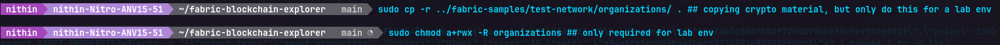

## fabric-blockchain-explorer
Note: You must complete Lab #1, Lab #2 and Lab #3 first which will include the required binary files.

Important: This requires the test network to be up and running with some transactions submitted.

## Install and make sure you have a private admin key available for the blockchain explorer

Log into Ubuntu and issue the following commands

```bash
cd ~
git clone https://github.com/lley154/fabric-blockchain-explorer.git
cd fabric-blockchain-explorer/
mkdir wallet
sudo cp -r ../fabric-samples/test-network/organizations/ . ## copying crypto material, but only do this for a lab env
sudo chmod a+rwx -R organizations ## only required for lab env
```



Set the paths in the .env file to point to your home directory

```bash
echo "FABRIC_CRYPTO_PATH=$HOME/fabric-blockchain-explorer/organizations" >> .env
echo "WALLET_PATH=$HOME/fabric-blockchain-explorer/wallet" >> .env  
```


Copy the generated private key for admin in org1 to priv_sk

```bash
cd ~/fabric-blockchain-explorer/organizations/peerOrganizations/org1.example.com/users/Admin@org1.example.com/msp/keystore/
sudo cp *_sk priv_sk
cd ~/fabric-blockchain-explorer
```

Now bring up docker images for postgresDB and explorer UI
```bash
docker compose up
```


Now use a browser on your local machine and access the Hyperledger Blockchain Explorer UI

```browser
http://localhost:8080/
user: exploreradmin
pass: exploreradminpw
```


Response times may be slow, so please wait for pages or links to load. A browser page refresh may also be required. You will see logging info messages when you try to access the explorer. If you encounter errors, please continue to submit with screen shots of the errors to receive full marks.

To shutdown the block exporer, use 'control c' command to stop the block exprorer process.

